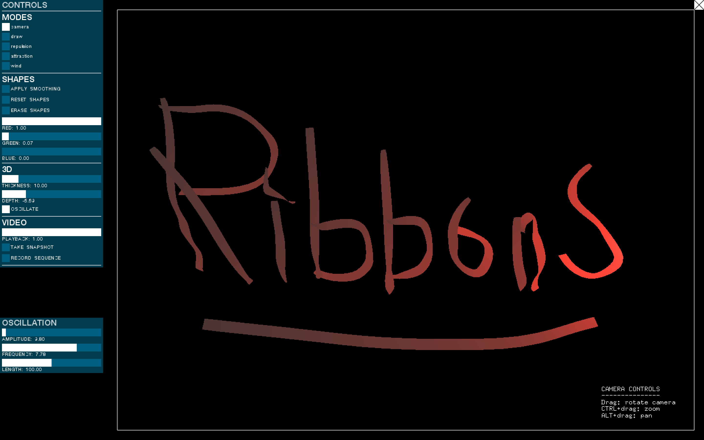
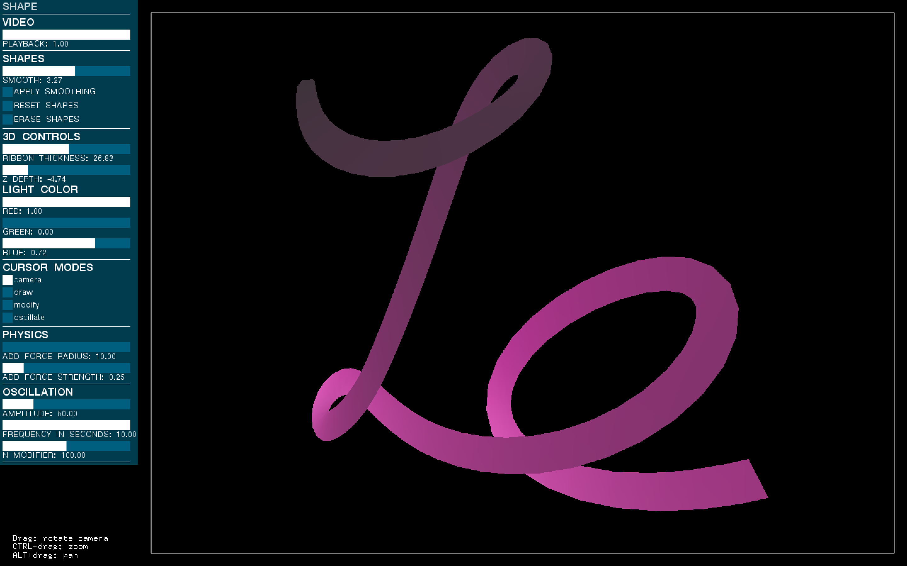
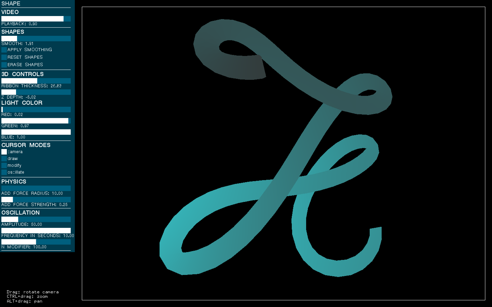

# Ribbons

MFA Design and Technology, Parsons The New School for Design

[Creative Coding: Simulation Studio](github.com/patriciogonzalezvivo/sims2014), Professor [Patricio Gonzalez Vivo](github.com/patriciogonzalezvivo)

Fall, 2014

---

This is a tool I’m working on right now. It still doesn’t have a proper name, so I’m calling it a **Ribbons**. It was inspired by [this trend of letterings with ribbons](https://www.google.com/search?q=images&espv=2&biw=1597&bih=816&source=lnms&tbm=isch&sa=X&ei=UYd6VNaeNO7fsATdooLgAg&ved=0CAYQ_AUoAQ#tbm=isch&q=ribbon+typography), which was very popular a few years ago. 

Prototypes:

* [Prototype 3](https://vimeo.com/108398582)

* [Prototype 2](https://vimeo.com/108173481) 

* [Prototype 1](https://vimeo.com/108160517) 

The previous version developed for the midterm can be found [here](../06_midterm).

## To do

* Set normals
* Add option to save vector shape