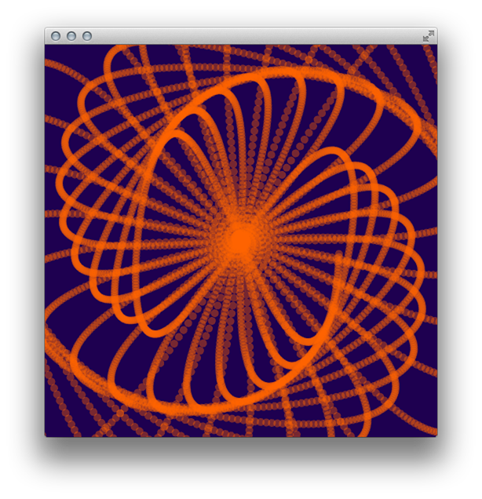
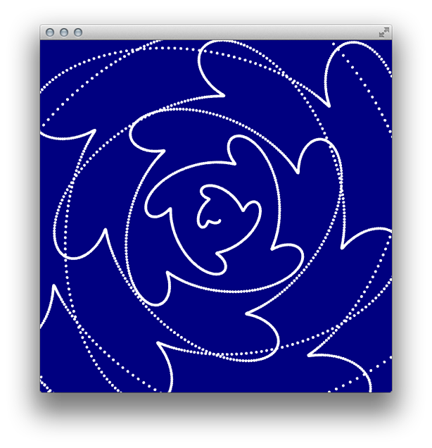
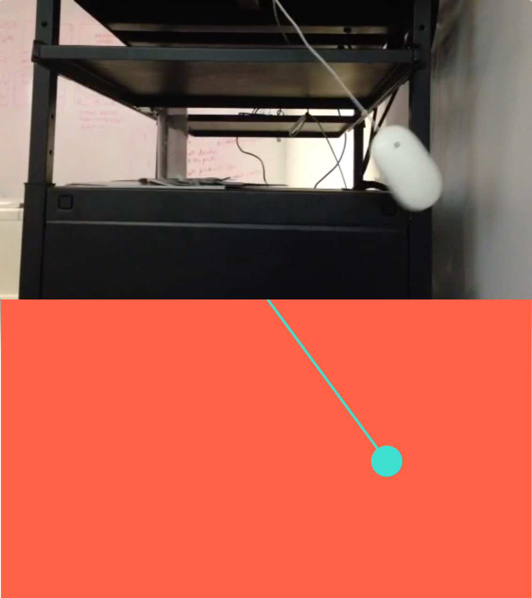

# Homework: week 02
## Non-code:
a) Using a stationary video camera, make three recordings of three different scenes which have interesting motion. Pick one point to watch during the video, and sketch out it’s motion path. Try to find both rhythmic (repetitive) and organic motions.

###"Living in D12:"
* [1st video](https://vimeo.com/105807857)
* [2nd video](https://vimeo.com/105807858)
* [3rd video](https://vimeo.com/105807859)

## Code:
a) Create a square canvas, and play with leaving trails for objects in motion by not clearing the screen. Play with shapes and colors and see what the most interesting composition you can make is. Take screenshots of the top 3 you come up with.

b) Use sin / cos to emulate a natural phenomenon. Post a picture or video of what your phenomenon is along with you application.
