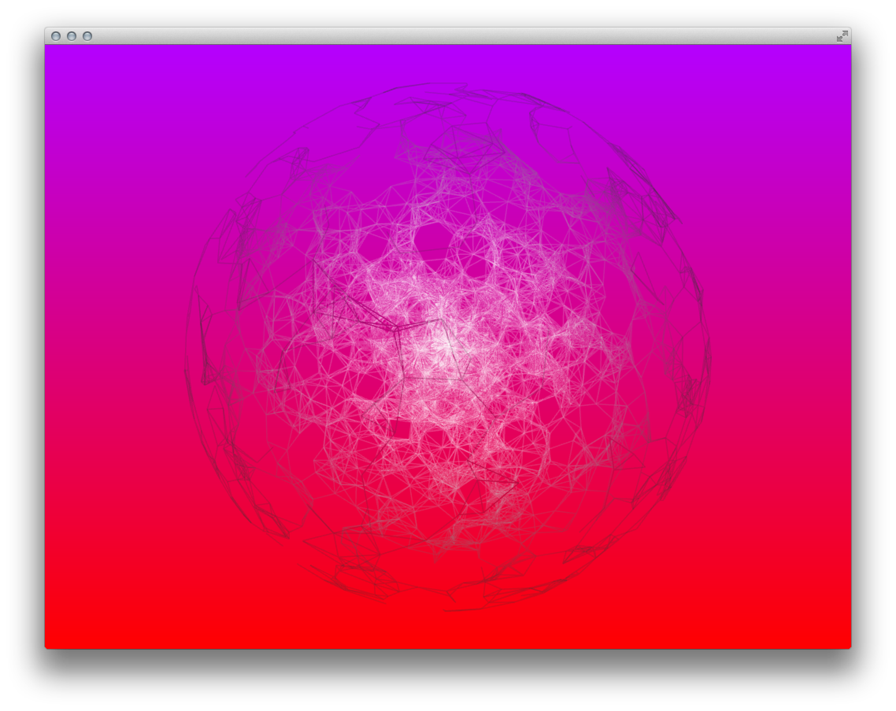
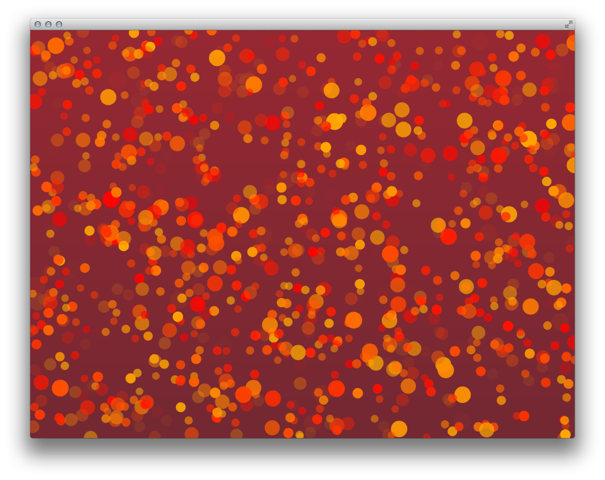
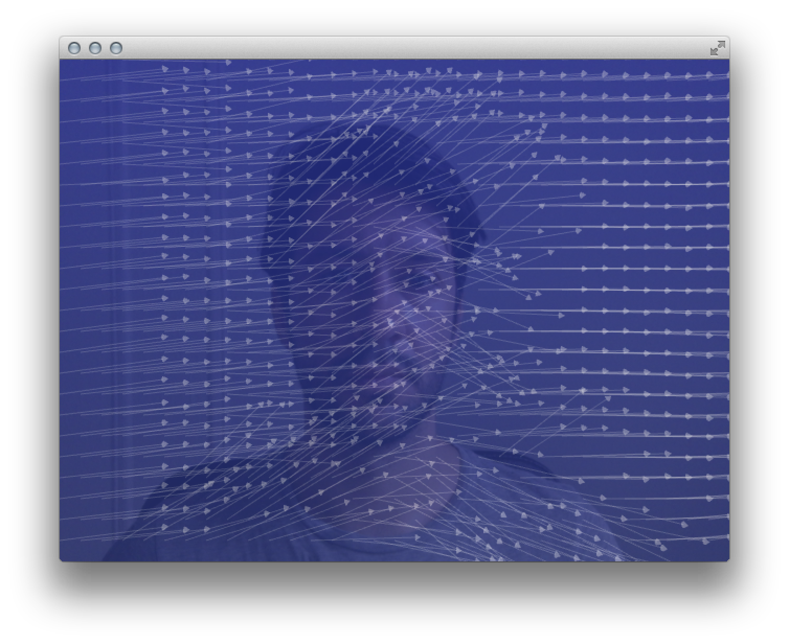

# Homework: week 07

##Code:

1. Changes to [Regina Flores midterm project](https://github.com/reginaflores/florr422_sims2014/tree/master/06_midterm_4). 
I only cleaned up a few things to improve performance, and added a switch to start/stop recording. Also, added a NICE gradient background! :)

2. Vector field:
	* Changing direction based on mouse movement (plus some aesthetics changes to Charlie Whitney's original code). Video [here](https://vimeo.com/113204504).
		
	* Reading pixels from camera and changing direction of vector field based on their brightness. Video [here](https://vimeo.com/113207468).
	

3. Implement a 3D vector field and apply on it a 3D Perlin noise